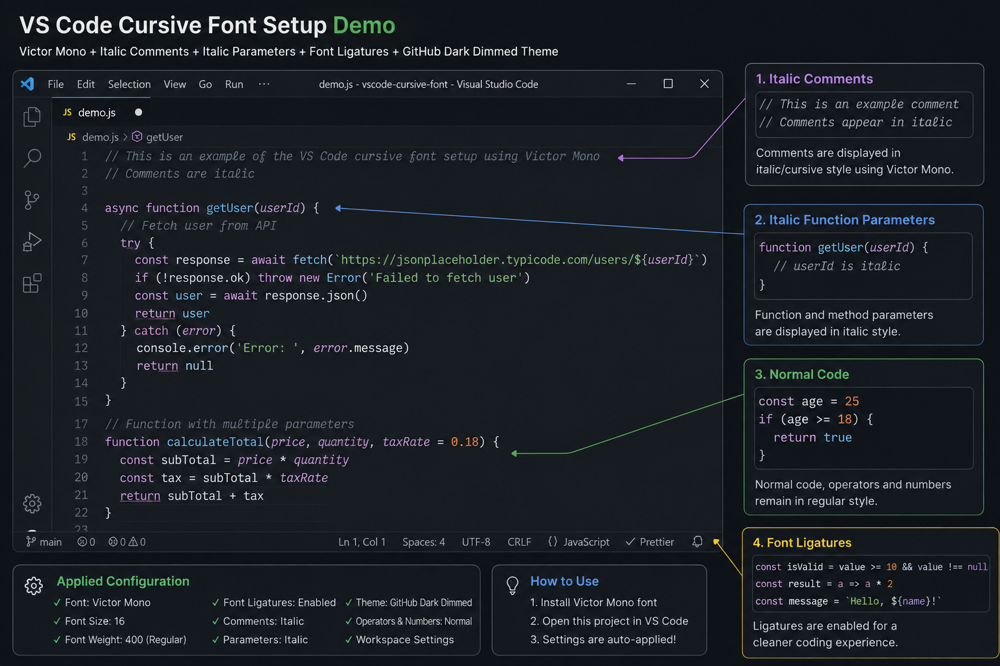

# VS Code Cursive Font Setup

A reusable and developer-friendly **Visual Studio Code configuration** for using the **Victor Mono** programming font with italic/cursive comments, italic function parameters, font ligatures, and the GitHub Dark Dimmed theme.

This repository is intended to make the VS Code editor appearance easy to reproduce on a **new computer, fresh OS installation, or another developer's system** without manually configuring every setting again.

---

## Preview



---

## Overview

This repository provides a workspace-level VS Code configuration that includes:

* **Victor Mono** as the primary coding font
* Italic/cursive styling for comments
* Italic styling for function and method parameters
* Font ligatures
* Regular font weight for normal code
* GitHub Dark Dimmed editor theme
* Fallback fonts when Victor Mono is unavailable
* Workspace-specific VS Code settings
* Setup documentation for new developers

The repository does **not** contain the Victor Mono font files. The font must be installed separately on each computer.

---

## Features

### Victor Mono

The configuration uses **Victor Mono** as the primary editor font.

Fallback fonts are also configured:

```text
Victor Mono
Consolas
Courier New
monospace
```

If Victor Mono is installed, VS Code will use it. If it is not available, VS Code will use the next available fallback font.

---

### Cursive / Italic Comments

Comments are displayed using the italic variant of Victor Mono.

Example:

```javascript
// Fetch user information from the API

const user = await fetchUser();
```

The comment will appear in the italic/cursive style while the actual code remains in the regular style.

---

### Italic Function Parameters

Function and method parameters are configured to use italic styling.

Example:

```javascript
function getUser(userId) {
    return userId;
}
```

The `userId` parameter will use the italic variant of Victor Mono.

---

### Font Ligatures

Font ligatures are enabled:

```json
"editor.fontLigatures": true
```

This allows Victor Mono to render supported programming characters using its ligature design.

For example:

```text
=>  !=  ===  >=  <=
```

Ligature rendering depends on the selected font and programming language.

---

### GitHub Dark Dimmed Theme

The workspace uses:

```text
GitHub Dark Dimmed
```

This provides a dark editor appearance that works well with the Victor Mono font and italic syntax styling.

---

# Repository Structure

```text
vscode-cursive-font/
│
├── .vscode/
│   └── settings.json
│
├── README.md
│
└── .gitignore
```

### `.vscode/settings.json`

Contains the workspace-level VS Code configuration.

### `README.md`

Contains installation instructions, configuration details, troubleshooting steps, and usage information.

### `.gitignore`

Prevents temporary files, operating-system files, logs, and other unnecessary files from being committed.

---

# Prerequisites

Before using this configuration, make sure the following are installed:

1. Visual Studio Code
2. Git
3. Victor Mono font

---

# 1. Install Visual Studio Code

Install the latest stable version of Visual Studio Code on your computer.

After installation, verify that VS Code opens correctly.

You can check the installed version from the terminal:

```bash
code --version
```

If the `code` command is not available, you can still open the repository manually from VS Code.

---

# 2. Install Git

Git is required to clone this repository.

Verify the installation:

```bash
git --version
```

If Git is installed correctly, the command will display the installed Git version.

---

# 3. Download and Install Victor Mono

Victor Mono is required for the intended cursive/italic coding appearance.

### Official Victor Mono Website

Download Victor Mono from the official website:

**https://rubjo.github.io/victor-mono/**

The font is **not included in this repository**.

Each developer must install Victor Mono separately on their computer.

---

## Windows Installation

1. Open the official Victor Mono website:

   https://rubjo.github.io/victor-mono/

2. Download the Victor Mono font package.

3. Extract the downloaded ZIP file.

4. Open the extracted folder.

5. Select the required font files.

6. Right-click the selected font files.

7. Select **Install** or **Install for all users**.

8. Wait for the installation to complete.

9. Restart Visual Studio Code.

After installation, the system should have access to:

```text
Victor Mono
```

### Important

Do not add the Victor Mono `.ttf` or `.otf` font files to this GitHub repository.

The repository contains the VS Code configuration only.

---

# 4. Clone the Repository

Open a terminal and clone the repository:

```bash
git clone <YOUR_GITHUB_REPOSITORY_URL>
```

Replace:

```text
<YOUR_GITHUB_REPOSITORY_URL>
```

with the actual GitHub repository URL.

Example:

```bash
git clone https://github.com/YOUR_USERNAME/vscode-cursive-font.git
```

Move into the project directory:

```bash
cd vscode-cursive-font
```

---

# 5. Open the Repository in VS Code

If the VS Code `code` command is available, run:

```bash
code .
```

Alternatively:

1. Open Visual Studio Code.
2. Select **File → Open Folder**.
3. Select the cloned `vscode-cursive-font` folder.
4. Open the project.

Once the repository is opened, VS Code will detect:

```text
.vscode/settings.json
```

and apply the workspace settings.

---

# 6. VS Code Configuration

The main configuration file is:

```text
.vscode/settings.json
```

The configuration is intentionally stored inside the repository so that it can be shared through Git.

This means another developer does not need to manually configure the same editor settings.

---

# 7. Manually Apply the Configuration in VS Code

The repository contains `.vscode/settings.json`, but you can also apply the same configuration manually to your VS Code user settings.

This is useful when:

* You want the configuration to work across all VS Code projects.
* You are setting up a new computer.
* You are not using the repository as a workspace.
* Another developer wants to copy the configuration into their personal VS Code settings.

---

## Open `settings.json`

In VS Code:

1. Open Visual Studio Code.
2. Press:

```text
Ctrl + Shift + P
```

3. Search for:

```text
Preferences: Open User Settings (JSON)
```

4. Select:

```text
Preferences: Open User Settings (JSON)
```

VS Code will open your `settings.json` file.

---

## Alternative Method

You can also:

1. Open VS Code.
2. Go to **File → Preferences → Settings**.
3. Click the **Open Settings (JSON)** icon in the top-right corner.

This opens the same `settings.json` file.

---

## Add the Configuration

Inside your VS Code `settings.json`, add the following configuration:

```jsonc
{
    "editor.fontFamily": "'Victor Mono', Consolas, 'Courier New', monospace",
    "editor.fontSize": 16,
    "editor.fontWeight": "400",
    "editor.fontLigatures": true,

    // Makes comments and function parameters italic
    "editor.tokenColorCustomizations": {
        "textMateRules": [
            {
                "scope": [
                    "comment",
                    "variable.parameter"
                ],
                "settings": {
                    "fontStyle": "italic"
                }
            },
            {
                "scope": [
                    "invalid",
                    "keyword.operator",
                    "constant.numeric.css",
                    "keyword.other.unit.px.css",
                    "constant.numeric.decimal.js",
                    "constant.numeric.json"
                ],
                "settings": {
                    "fontStyle": ""
                }
            }
        ]
    },

    "workbench.colorTheme": "GitHub Dark Dimmed"
}
```

### Important

If your existing `settings.json` already contains other settings, **do not delete them**.

Add or merge these settings into your existing configuration.

For example, if you already have:

```json
{
    "editor.fontSize": 14,
    "git.enabled": true
}
```

do not replace the entire file.

Instead, update the relevant settings:

```json
{
    "editor.fontSize": 16,
    "git.enabled": true,
    "editor.fontFamily": "'Victor Mono', Consolas, 'Courier New', monospace",
    "editor.fontWeight": "400",
    "editor.fontLigatures": true
}
```

and add the `editor.tokenColorCustomizations` configuration.

---

# 8. Font Configuration

The primary font is configured using:

```json
"editor.fontFamily": "'Victor Mono', Consolas, 'Courier New', monospace"
```

The font priority is:

```text
1. Victor Mono
2. Consolas
3. Courier New
4. monospace
```

If Victor Mono is installed, VS Code will use it.

If Victor Mono is unavailable, VS Code will attempt to use the next available fallback font.

---

# 9. Font Size

The default font size is:

```json
"editor.fontSize": 16
```

This can be changed according to personal preference.

For example:

```json
"editor.fontSize": 15
```

or:

```json
"editor.fontSize": 17
```

The repository uses `16` as the default because it provides a good balance between readability and the amount of code visible on screen.

---

# 10. Font Weight

The default font weight is:

```json
"editor.fontWeight": "400"
```

`400` represents regular font weight.

This is intentional because the desired appearance uses italic/cursive styling for selected syntax rather than making the entire editor bold.

Avoid using:

```json
"editor.fontWeight": "bold"
```

unless you specifically want all code to appear bold.

---

# 11. Font Ligatures

Font ligatures are enabled with:

```json
"editor.fontLigatures": true
```

This allows Victor Mono to use its programming ligature characters where supported.

For example:

```javascript
const isValid = value >= 10 && value !== null;
```

The visual appearance of operators may be modified by the font's ligature support.

---

# 12. Cursive / Italic Styling

The italic styling is controlled using:

```json
"editor.tokenColorCustomizations"
```

and TextMate scopes.

The configuration targets:

```text
comment
variable.parameter
```

These scopes are assigned:

```json
"fontStyle": "italic"
```

---

## Comments

The following scope targets comments:

```text
comment
```

Example:

```javascript
// Fetch user information from the server

const user = await fetchUser();
```

The comment will use Victor Mono's italic variant.

---

## Function Parameters

The following scope targets function and method parameters:

```text
variable.parameter
```

Example:

```javascript
function getUser(userId) {
    return userId;
}
```

The `userId` parameter is configured to use italic styling.

---

# 13. Preventing Unwanted Italic Styling

Some syntax scopes are explicitly reset to regular styling:

```text
invalid
keyword.operator
constant.numeric.css
keyword.other.unit.px.css
constant.numeric.decimal.js
constant.numeric.json
```

These scopes use:

```json
"fontStyle": ""
```

This prevents certain operators and numeric values from unnecessarily inheriting italic styling.

For example:

```javascript
const age = 25;
const isAdult = age >= 18;
```

The numeric values and operators should remain visually normal.

---

# 14. Theme Configuration

The workspace uses:

```json
"workbench.colorTheme": "GitHub Dark Dimmed"
```

This theme provides the dark editor appearance used with this configuration.

If the theme is not available in your VS Code installation, you can install it through the VS Code Extensions panel or select another theme manually.

Changing the theme will not affect the Victor Mono font configuration.

---

# 15. Complete `.vscode/settings.json`

The complete workspace configuration used by this repository is:

```jsonc
{
    "editor.fontFamily": "'Victor Mono', Consolas, 'Courier New', monospace",
    "editor.fontSize": 16,
    "editor.fontWeight": "400",
    "editor.fontLigatures": true,

    // Makes comments and function parameters italic
    "editor.tokenColorCustomizations": {
        "textMateRules": [
            {
                "scope": [
                    "comment",
                    "variable.parameter"
                ],
                "settings": {
                    "fontStyle": "italic"
                }
            },
            {
                "scope": [
                    "invalid",
                    "keyword.operator",
                    "constant.numeric.css",
                    "keyword.other.unit.px.css",
                    "constant.numeric.decimal.js",
                    "constant.numeric.json"
                ],
                "settings": {
                    "fontStyle": ""
                }
            }
        ]
    },

    "workbench.colorTheme": "GitHub Dark Dimmed"
}
```

---

# 16. Verify the Configuration

After installing Victor Mono and opening the repository, create or open a JavaScript or TypeScript file.

Add the following:

```javascript
// This comment should appear italic/cursive

function getUser(userId) {
    const user = {
        id: userId,
        name: "John",
        age: 25
    };

    return user;
}
```

The expected appearance is:

```text
Comments            → Italic / cursive
Function parameters → Italic / cursive
Normal code         → Regular
Numbers             → Regular
Operators           → Regular
Font                → Victor Mono
Theme               → GitHub Dark Dimmed
```

---

# 17. Troubleshooting

## Victor Mono Is Not Being Applied

If the editor is not using Victor Mono, follow these steps.

### Step 1 — Confirm the Font Is Installed

Make sure Victor Mono is installed correctly on your computer.

On Windows:

```text
Settings → Personalization → Fonts
```

Search for:

```text
Victor Mono
```

If Victor Mono appears in the installed fonts list, the font is installed.

If it does not appear, download and install it again from:

https://rubjo.github.io/victor-mono/

---

### Step 2 — Completely Close VS Code

Close all VS Code windows.

Make sure VS Code is completely closed before continuing.

---

### Step 3 — Open VS Code Again

Open Visual Studio Code normally.

---

### Step 4 — Reload the VS Code Window

Open the Command Palette:

```text
Ctrl + Shift + P
```

Search for:

```text
Developer: Reload Window
```

Press **Enter**.

---

### Step 5 — Check `settings.json`

Open your VS Code `settings.json`:

```text
Ctrl + Shift + P
```

Search:

```text
Preferences: Open User Settings (JSON)
```

Press **Enter**.

Confirm that your configuration contains:

```json
"editor.fontFamily": "'Victor Mono', Consolas, 'Courier New', monospace"
```

Also confirm:

```json
"editor.fontLigatures": true
```

and:

```json
"editor.fontWeight": "400"
```

---

### Step 6 — Check the Font Family in VS Code Settings

Open:

```text
Settings → Text Editor → Font
```

Find:

```text
Font Family
```

Confirm that it contains:

```text
'Victor Mono'
```

---

## Cursive Comments Are Not Working

If Victor Mono is working but comments are not italic:

1. Open `.vscode/settings.json` or your User `settings.json`.
2. Confirm that `editor.tokenColorCustomizations` exists.
3. Confirm that the comment scope is:

```text
comment
```

4. Confirm that the style is:

```json
"fontStyle": "italic"
```

The relevant configuration is:

```json
{
    "scope": [
        "comment",
        "variable.parameter"
    ],
    "settings": {
        "fontStyle": "italic"
    }
}
```

Reload VS Code after making changes.

---

# 18. Code Is Completely Bold

If all your code appears bold, check that you have:

```json
"editor.fontWeight": "400"
```

Do not use:

```json
"editor.fontWeight": "bold"
```

The `400` setting keeps normal code at regular weight.

---

# 19. New Computer Setup

This repository is specifically designed to make setup easy when moving to a new computer.

Follow these steps:

### Step 1 — Install Git

Verify:

```bash
git --version
```

### Step 2 — Install VS Code

Install Visual Studio Code.

### Step 3 — Download and Install Victor Mono

Use the official Victor Mono website:

https://rubjo.github.io/victor-mono/

Install the font on the operating system.

### Step 4 — Clone the Repository

```bash
git clone <YOUR_GITHUB_REPOSITORY_URL>
```

### Step 5 — Open the Project

```bash
cd vscode-cursive-font
code .
```

### Step 6 — Reload VS Code If Necessary

Open:

```text
Ctrl + Shift + P
```

and run:

```text
Developer: Reload Window
```

### Step 7 — Verify

Open a JavaScript or TypeScript file and confirm:

* Victor Mono is being used.
* Comments appear italic/cursive.
* Function parameters appear italic.
* Normal code remains regular.
* Font ligatures are enabled.
* GitHub Dark Dimmed is applied.

---

# 20. Setup for Another Developer

Another developer can use this repository without manually recreating the complete configuration.

They need to:

1. Install VS Code.
2. Install Git.
3. Download Victor Mono.
4. Install Victor Mono.
5. Clone this repository.
6. Open the repository in VS Code.

Commands:

```bash
git clone <YOUR_GITHUB_REPOSITORY_URL>
cd vscode-cursive-font
code .
```

The workspace configuration will automatically be loaded from:

```text
.vscode/settings.json
```

If the developer wants the configuration to apply to **all VS Code projects**, they can also copy the same configuration into their User `settings.json`.

---

# 21. Workspace Settings vs User Settings

This repository uses:

```text
.vscode/settings.json
```

These are **workspace settings**.

They apply when this specific repository is opened in VS Code.

### Workspace Settings

Stored inside the project:

```text
project/
└── .vscode/
    └── settings.json
```

### User Settings

Stored in the developer's global VS Code configuration.

These settings apply across all projects.

The repository does not require developers to replace their complete global `settings.json`.

---

# 22. Why the Font Is Not Stored in Git

Victor Mono is intentionally not included in this repository.

The repository stores:

```text
VS Code configuration
```

while the operating system stores:

```text
Victor Mono font
```

The setup works like this:

```text
GitHub Repository
        │
        ├── .vscode/settings.json
        │       ├── Font Family
        │       ├── Font Size
        │       ├── Font Weight
        │       ├── Font Ligatures
        │       ├── Italic Comments
        │       └── Italic Parameters
        │
        └── README.md
                └── Installation Instructions

Developer Computer
        │
        └── Victor Mono Font
```

This keeps the repository lightweight and focused on configuration.

---

# 23. Git Configuration

The `.gitignore` file excludes temporary and unnecessary files such as:

```text
.DS_Store
Thumbs.db
*.log
*.tmp
*.bak
```

However, `.vscode/settings.json` remains tracked.

Do not add:

```text
.vscode/
```

to `.gitignore`.

The `.vscode/settings.json` file is required for the workspace configuration.

---

# 24. Updating the Configuration

If you change the VS Code configuration in the future, check the changes:

```bash
git status
```

Review the differences:

```bash
git diff
```

Add the configuration:

```bash
git add .vscode/settings.json
```

Create a commit:

```bash
git commit -m "Update VS Code editor configuration"
```

Push the changes:

```bash
git push
```

Other developers can update their local configuration:

```bash
git pull
```

---

# 25. Recommended Customizations

You can customize the configuration according to your preference.

### Change Font Size

```json
"editor.fontSize": 17
```

### Disable Ligatures

```json
"editor.fontLigatures": false
```

### Disable Italic Comments and Parameters

Change:

```json
"fontStyle": "italic"
```

to:

```json
"fontStyle": ""
```

### Make Italic Styling Bold

```json
"fontStyle": "italic bold"
```

For the intended clean appearance, use:

```json
"fontStyle": "italic"
```

---

# 26. Recommended Default Configuration

| Setting             | Value              |
| ------------------- | ------------------ |
| Font                | Victor Mono        |
| Font Size           | 16                 |
| Font Weight         | 400                |
| Font Ligatures      | Enabled            |
| Comments            | Italic             |
| Function Parameters | Italic             |
| Theme               | GitHub Dark Dimmed |
| Configuration Type  | Workspace          |

---

# 27. Quick Setup

For an experienced developer:

### 1. Install Victor Mono

Download from:

https://rubjo.github.io/victor-mono/

### 2. Clone the repository

```bash
git clone <YOUR_GITHUB_REPOSITORY_URL>
```

### 3. Open the project

```bash
cd vscode-cursive-font
code .
```

### 4. Reload VS Code if required

```text
Ctrl + Shift + P
→ Developer: Reload Window
```

---

# 28. Repository Maintenance

Keep this repository focused on VS Code editor configuration.

Recommended files:

```text
.vscode/settings.json
README.md
.gitignore
```

Avoid committing:

* Font files
* API keys
* Passwords
* Personal credentials
* Machine-specific configuration
* Temporary files
* Build output
* Logs
* Unrelated personal VS Code settings

This keeps the repository clean, reusable, and easy for other developers to understand.

---

# License

This repository contains VS Code configuration and documentation.

Victor Mono is not included in this repository.

Victor Mono remains subject to its own license and distribution terms. Please follow the official Victor Mono project's licensing and distribution requirements when downloading and installing the font.

---

## Author

Maintained as a reusable VS Code developer setup for a clean cursive coding experience.
